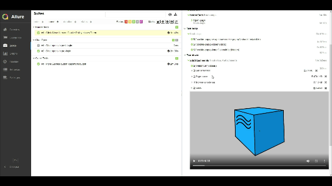
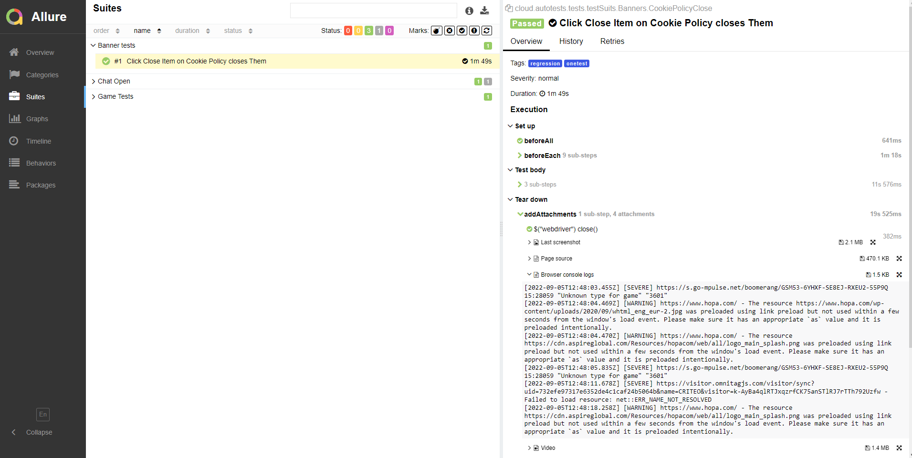
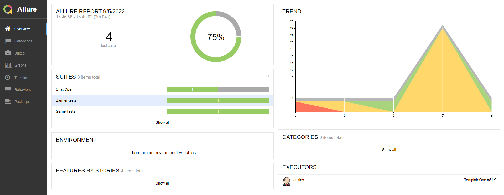
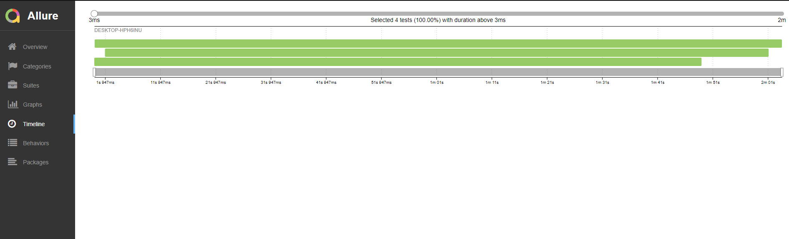
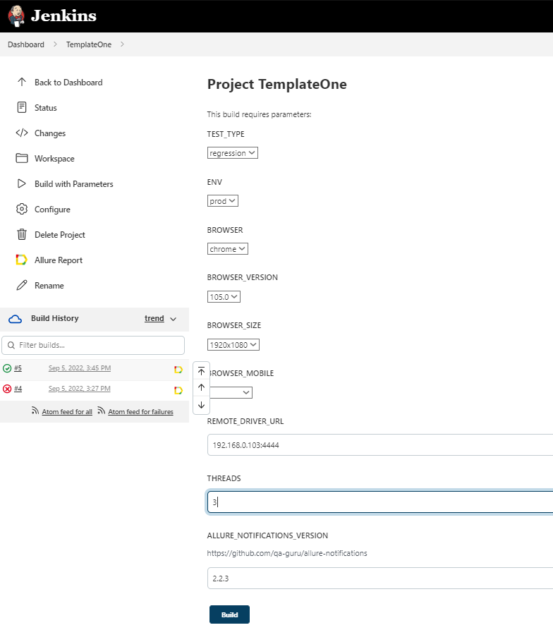
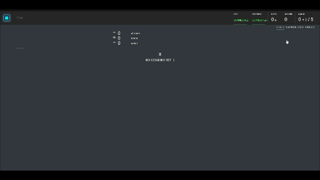

## Project automated tests with docker + selenoid
#### In project used: 
- Gradle
- Java 11 
- Selenide
- Allure Report
- Multithreading
#### The test stand use:

- Docker (docker compose file) 
- Selenoid 
- Jenkins

#### Allure report with video / Images / logs / page source




# Jenkins job

# Selenoid 


### For run remote tests need fill remote.properties or to pass value:

* browser (default chrome)
* browserVersion (default 104.0)
* browserSize (default 1920x1080)
* browserMobileView (mobile device name, for example iPhone X)
* remoteDriverUrl (url address from selenoid or grid)
* videoStorage (url address where you should get video)
* threads (number of threads)

Run tests with filled remote.properties:

```bash
gradle clean test
```

Run tests with not filled remote.properties:

```bash
gradle clean regression -DremoteDriverUrl=http://YourHost/wd/hub/ -DvideoStorage=http://yourHost/video/ -Dthreads=5 
```

Serve report:

```bash
allure serve build/allure-results
```

